# Ask‑Docs  
Local, Offline, Open‑Source Documentation Intelligence Engine

Ask‑Docs is a fully local, offline, open‑source documentation intelligence system.  
It ingests Markdown files, chunks them intelligently, embeds them using local models, and answers questions using a hybrid RAG + LLM pipeline.

Everything runs 100% locally — no cloud, no SaaS, no telemetry.


## Features

- Performance Optimized (ONNX Threading)
- Local RAG engine (no external APIs)
- LLM answer synthesis (local model)
- Confidence fallback mode (prevents hallucinations)
- Documentation Explorer UI
- Chunk visualization mode
- Fast local embeddings (Xenova)
- Benchmarking suite
- Config‑driven architecture
- CLI + Web UI
- RAG‑optimized docs folder
- Offline by design

## ⚙️ System Architecture & Documentation

Ask‑Docs is engineered as a 100% local, air-gapped RAG (Retrieval‑Augmented Generation) system. It utilizes the ONNX Runtime to execute both embedding and reasoning models on your local hardware.

### Visual Workflow & Data Processing

```mermaid
graph TD
    subgraph "1. Local Ingestion Engine (Offline)"
        A[docs/ folder] --> B[Data Collection: File Walker]
        B --> C{Cache Check: cache.json}
        C -- "Hash Match" --> D[Skip File]
        C -- "New/Changed" --> E[Heading-aware Chunker]
        E --> F[Local Embedding Model: Jina V2 Base]
        F --> G[(Local Vector Store: docs.json)]
    end

    subgraph "2. Offline Query Processor (No Cloud)"
        H[Terminal / Web UI Request] --> I[POST /ask]
        I --> J[Local Question Embedding]
        J --> K[Similarity Search vs docs.json]
        K --> L[Retrieve Top-5 Context Chunks]
        L --> M[Context-Restricted Prompt Construction]
        M --> N[Local LLM: Phi-3.5 Mini Instruct]
        N --> O[Offline Answer Synthesis]
        O --> P[Final Response + Exact Citations]
        P --> H
    end
```



### Technical Breakdown

1.  **Data Collection & Chunker**: The engine scans the `docs/` directory. It intelligently splits Markdown files into chunks of approximately 1200 characters while preserving the context of the nearest heading.
2.  **Caching Mechanism**: To ensure speed, `cache.json` tracks file hashes. Only modified or new files are sent to the embedding model, significantly reducing re-ingest time.
3.  **Local Embedding**: Chunks are processed by the `Xenova/jina-embeddings-v2-base-en` model running on the ONNX Runtime. This converts human language into high-dimensional vectors (embedded data) without sending data to a server.
4.  **Vector Store**: The resulting vectors and their corresponding text segments are stored in a local `docs.json` file.
5.  **Similarity Search**: When you ask a question, it is converted into a vector using the same local model. A dot-product calculation finds the most relevant chunks in your documentation.
6.  **Context-Restricted Synthesis**:
    *   **The Prompt**: The system merges the top 5 chunks into a specialized prompt: *"Rewrite the answer using ONLY the information in the context. Do NOT invent details. Write a clear, concise answer in 3–5 sentences."*
    *   **The Model**: The `Phi-3.5 Mini Instruct` (or chosen reasoning model) processes this prompt. Because it runs locally via `transformers.js`, no data ever leaves your machine.
7.  **Response**: The system returns a synthesized answer accompanied by exact citations (file name, heading, and line numbers) to ensure transparency and eliminate hallucinations.

## Project Structure
```
ask-docs/
  cli.js
  ask.js
  ingest.js
  synthesizer.js
  cache.js
  config.js
  vector-store/
docs/
  overview.md
  architecture.md
  authentication.md
  transactions.md
  errors.md
  exceptions.md
  examples.md
  glossary.md
  webhook-events.md
  sidebar.md
  index.md
  diagrams/
    transaction-flow.md
    system-architecture.md
web/
  src/
    components/
      Sidebar.jsx
      DocViewer.jsx
    pages/
      Docs.jsx
      Ask.jsx
    App.jsx
```


## Installation

```bash
git clone https://github.com/<your-repo>/ask-docs
cd ask-docs
npm install
```

## CLI Usage

### Ingest documentation

```bash
ask-docs ingest
```

Force rebuild:

```bash
ask-docs ingest --force
```

Debug mode:

```bash
ask-docs ingest --debug
```

## Ask a question

```bash
ask-docs ask "How does authentication work?"
```

Debug:

```bash
ask-docs ask "Explain settlement" --debug
```

---

## Web UI

Start the server:

```bash
npm run web
```

Open:

```URL
http://localhost:5174
```

Includes:

- Chat Q&A
- Docs Explorer
- Searchable Sidebar
- Chunk Visualization Mode
- Dark/Light mode


## RAG Pipeline Overview

1. Ingest  
   - Walk docs folder  
   - Chunk Markdown by headings  
   - Embed chunks  
   - Save vector store  

2. Ask  
   - Embed question  
   - Retrieve top chunks  
   - Score + rank  
   - Confidence check  
   - LLM synthesis  

3. Fallback  
   - Low confidence → LLM‑only answer  


## Chunking Strategy

- Heading‑aware
- 1200–1500 characters per chunk
- Each chunk includes:
  - file
  - heading
  - startLine / endLine
  - text
  - embedding


## Embedding Model

```
Xenova/jina-embeddings-v2-base-en
```

Runs fully local via ONNX.

## LLM Answer Synthesis

Model:

```MODEL
Xenova/llama-3.2-1b-instruct
```

Pipeline:

- Combine top chunks
- Generate 3–5 sentence answer
- Context‑restricted prompt


## Confidence Fallback Mode

If:

```
topScore < 0.12
```

Then:

- Skip RAG
- Generate LLM‑only answer
- No citations returned


## Document Explorer UI

Includes:

- Sidebar listing all docs
- Click to open any doc
- Search inside docs
- Syntax highlighting
- Mermaid diagram support


## Chunk Visualization Mode

Toggle:

```
[ ] Show chunks
```

Displays:

- Chunk preview
- Score
- File
- Heading
- Line numbers


## Benchmarking Suite

Run:

```bash
ask-docs benchmark
```

Outputs:

- Expected file
- Retrieved file
- Accuracy score


## Config File

`ask-docs.config.json`:

```json
{
  "docsPath": "./docs",
  "storePath": "./ask-docs/vector-store/docs.json",
  "chunkChars": 1200,
  "confidenceThreshold": 0.12,
  "enableLLM": true
}
```


## Vector Store Format

Each entry:

```json
{
  "id": "docs/authentication.md-0",
  "file": "authentication.md",
  "filePath": "./docs/authentication.md",
  "heading": "Overview",
  "startLine": 1,
  "endLine": 32,
  "text": "...",
  "embedding": [ ... ]
}
```

## Cache System

`cache.json` stores:

- file hash
- last modified time
- chunk metadata

Used to skip unchanged files.


## Docs Folder (RAG‑Optimized)

Includes:

- overview.md
- architecture.md
- authentication.md
- transactions.md
- errors.md
- exceptions.md
- examples.md
- glossary.md
- webhook-events.md
- sidebar.md
- index.md
- diagrams/


## Mermaid Diagrams

Located in:

```
docs/diagrams/
```

Includes:

- Transaction flow
- System architecture


## API Endpoints

```
GET /api/docs/list
GET /api/docs/get?name=<file>
POST /ask
```


## Logging

- Colored logs
- Per-file ingest timing
- Chunk-level logs
- Cache hits/misses


# Performance

- Embeddings cached
- LLM loaded once
- Optimized chunking
- Zero network calls


## Security

- Fully offline
- No telemetry
- No cloud dependencies


# Extensibility

Planned modules:

- PDF ingestion
- HTML ingestion
- Confluence connector
- GitHub Wiki ingestion
- Multi‑tenant workspace support


## Troubleshooting

### 🔴 Protobuf parsing failed
This error usually indicates that the ONNX model files are corrupt or incomplete.
1. **Git LFS Pointers**: Check if your `.onnx` files are only a few hundred bytes. If so, they are pointers and not the actual weights.
2. **Missing Split Weights**: Large models like Phi-3.5 require the `.onnx_data` file in the same directory as the `.onnx` file.
3. **Solution**: Re-run `bash download_models.sh` or follow the `manual_model_setup.md` guide.

### 🟡 No chunks found  
Check `docsPath`.

### 🟡 Always returns architecture.md  
Docs contained duplicate content — fixed now.

### 🟡 Slow ingest  
Enable caching or reduce chunk size.

### 🟢 Model Integrity
Run `node verify-models.js` to calculate SHA-256 checksums and verify file sizes.

## Roadmap

- Hybrid search (keyword + vector)
- Multi-hop reasoning
- Query rewriting
- Model auto‑selection
- Plugin system

## License

MIT License — fully open‑source and free to use.
