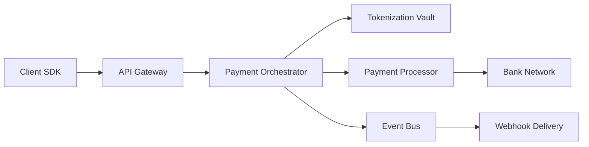

---

## 📄 **diagrams/system-architecture.md**

```md
<!--
file: diagrams/system-architecture.md
purpose: High-level system architecture diagram.
version: 1.0
-->

# System Architecture Diagram


```mermaid
flowchart LR
    A[Client SDK] --> B[API Gateway]
    B --> C[Payment Orchestrator]
    C --> D[Tokenization Vault]
    C --> E[Payment Processor]
    E --> F[Bank Network]
    C --> G[Event Bus]
    G --> H[Webhook Delivery]
```