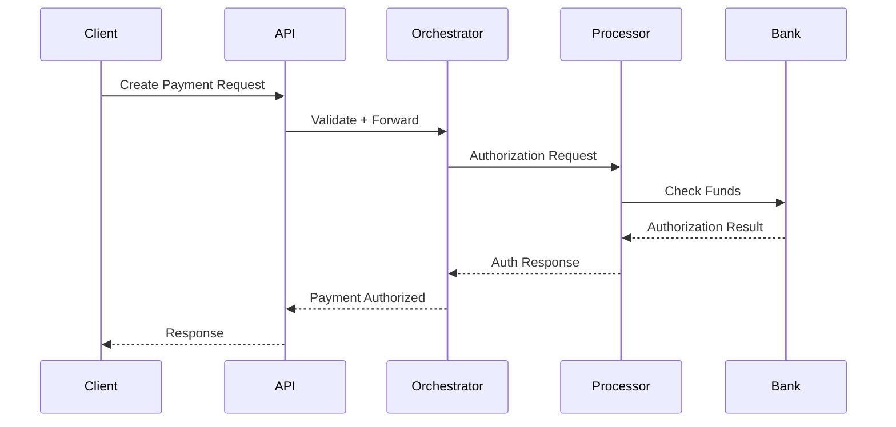

<!--
file: diagrams/transaction-flow.md
purpose: Visual flow of the transaction lifecycle.
version: 1.0
-->

# Transaction Flow Diagram

```mermaid
sequenceDiagram
    participant Client
    participant API
    participant Orchestrator
    participant Processor
    participant Bank

    Client->>API: Create Payment Request
    API->>Orchestrator: Validate + Forward
    Orchestrator->>Processor: Authorization Request
    Processor->>Bank: Check Funds
    Bank-->>Processor: Authorization Result
    Processor-->>Orchestrator: Auth Response
    Orchestrator-->>API: Payment Authorized
    API-->>Client: Response
```