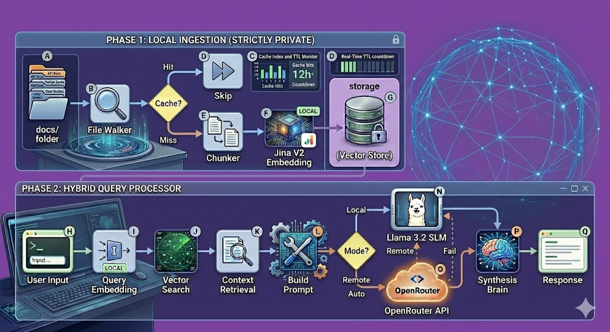
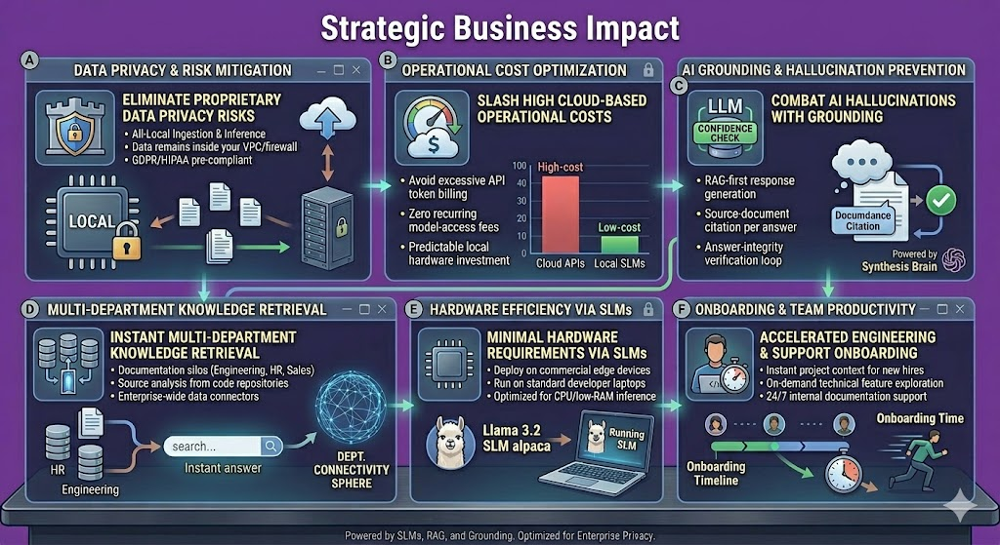
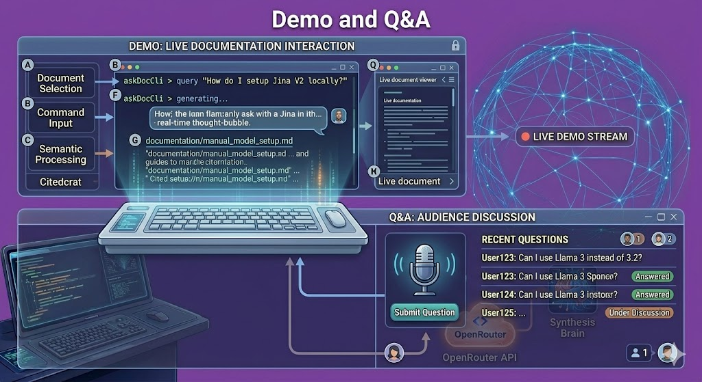
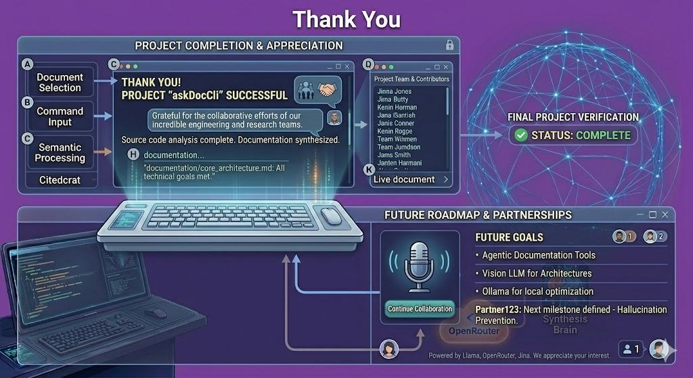

<!-- .slide: data-background-color="#8347AD" -->
# **ask-DocCli**
 Markdown to Conversational Intelligence

---
<!-- .slide: data-background-color="#8347AD" -->
## **The Local-First Vision**

---
1. 100% local performance optimized engine
2. Zero cloud dependencies or SaaS
3. No telemetry or external data leaks
4. Privacy-first RAG pipeline architecture
5. Air-gapped environment ready

<!-- .slide: data-background-color="#8347AD" -->
---
<!-- .slide: data-background-color="#8347AD" -->

---
<!-- .slide: data-background-color="#8347AD" -->
## **Primary Use Cases**
---
1. **Onboarding**: Instant architectural context for engineers
2. **Compliance**: Secure cross-referencing of internal policies
3. **Support**: Real-time triage using technical manuals
4. **Remote**: Intelligence for offline field operations
<!-- .slide: data-background-color="#8347AD" -->
---
<!-- .slide: data-background-color="#8347AD" -->
## **Technical Model Architecture**
---
* Standardized 4-bit quantized ONNX models
* Strictly structured directory hierarchy
* Low-footprint embedding and reasoning weights
<!-- .slide: data-background-color="#8347AD" -->
---
<!-- .slide: data-background-color="#8347AD" -->
## **CLI Interface & Workflow**
---
1. `ingest`: Build local vector store
2. `ingest --force`: Rebuild from scratch
3. `ask`: Query the intelligence engine
4. `ask --debug`: Inspect scores and citations
<!-- .slide: data-background-color="#8347AD" -->
---
<!-- .slide: data-background-color="#8347AD" -->

---

<!-- .slide: data-background-color="#8347AD" -->
